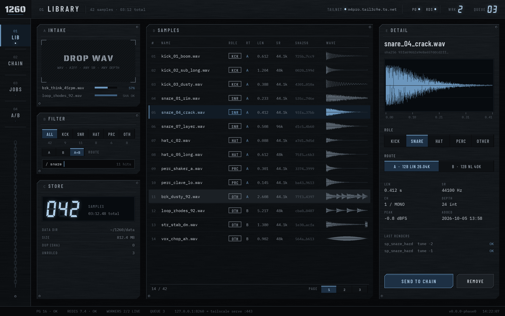
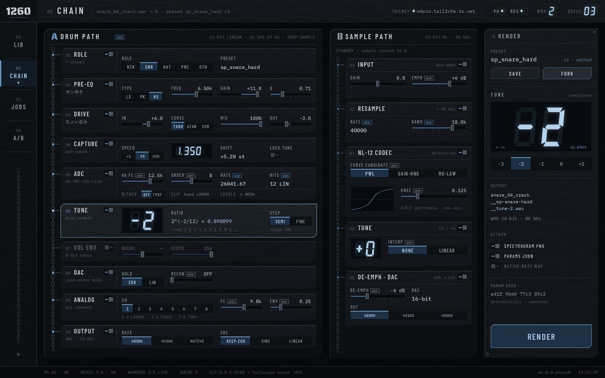
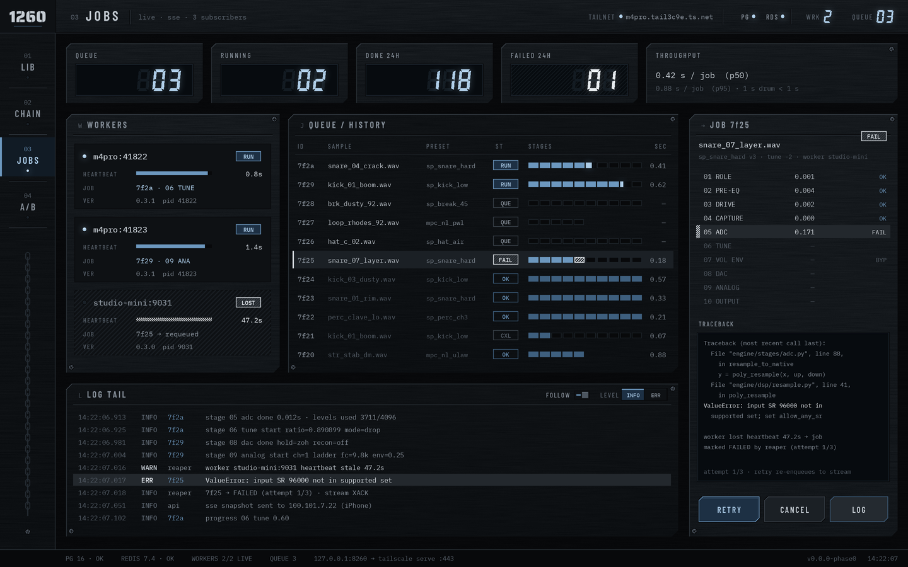
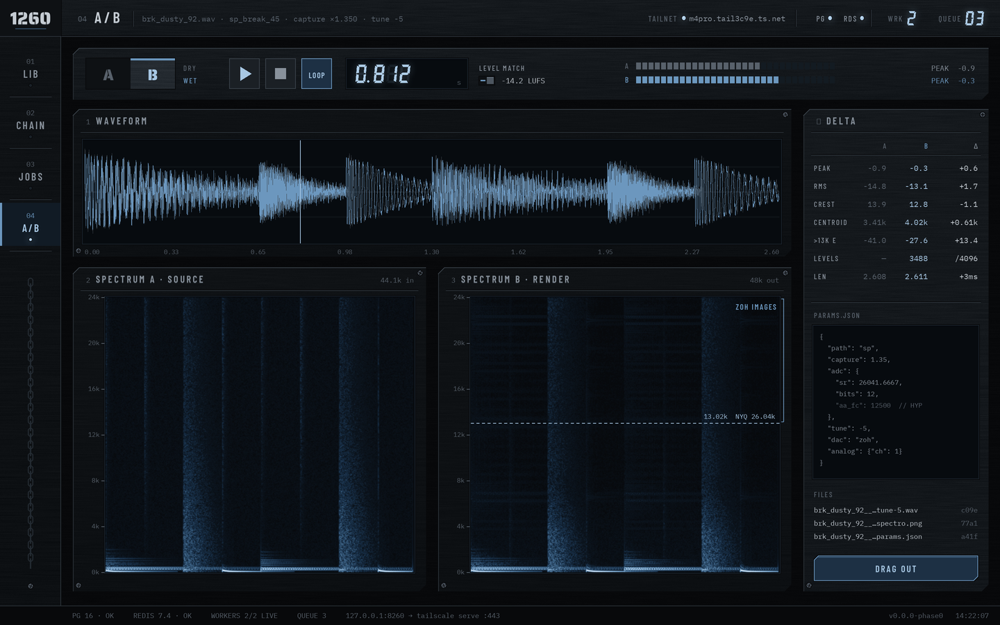
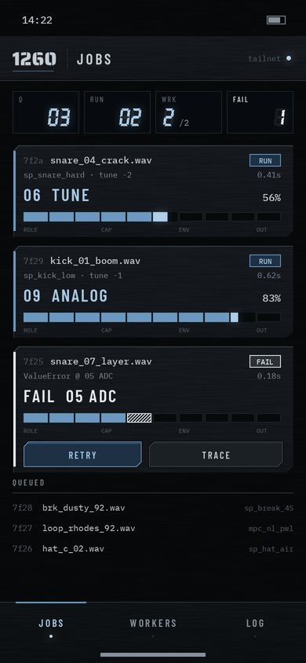
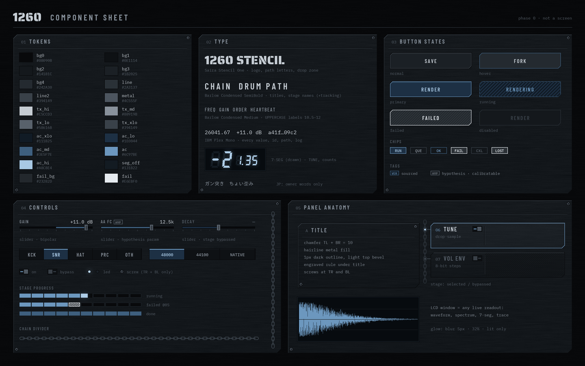

# 1260（仮称）

SP-1200 drums × MPC60II samples — an offline timbre engine. Drop a WAV in, get it back rendered through modelled
hardware stages (12-bit linear @ 26.04 kHz with drop-sample TUNE for drums; non-linear 12-bit @ 40 kHz for samples).

Status: **Phase 0 — screen mockups, awaiting approval.** See `CLAUDE.md` for the phase gates and rules,
`docs/research.md` for what is verified vs. hypothesis.

```
make mockups        # regenerate design/mockups/*.png
```

| | |
|---|---|
|  |  |
|  |  |
|  |  |

Fonts in `design/fonts/` are under the SIL Open Font License (licence files alongside).
