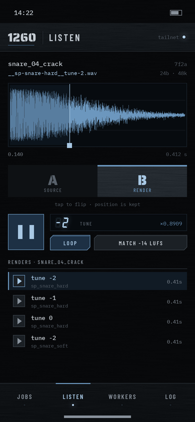

# 1260（仮称）

SP-1200 drums × MPC60II samples — an offline timbre engine. Drop a WAV in, get it back rendered through modelled
hardware stages (12-bit linear @ 26.04 kHz with drop-sample TUNE for drums; non-linear 12-bit @ 40 kHz for samples).

Status: **Phase 3 — UI** (LIBRARY / CHAIN / JOBS / A/B on desktop, JOBS / LISTEN / WORKERS / LOG on iPhone; React + Vite in
`web/`, served by the API). Phase 2 engine done. Phase 1 skeleton (OrbStack, launchd, tailscale serve) awaits a check on the Mac.
See `CLAUDE.md` for the phase gates and rules, `design.md` for the UI rules, `docs/research.md` for what is verified
vs. hypothesis, and `docs/runbook.md` to run it on the Mac.

```
make setup && make infra && make migrate && make dev   # http://127.0.0.1:8260/  (setup builds the UI: needs node + pnpm)
make test
uv run python -m engine render snare.wav --preset sp_snare_hard --tune -2   # → snare__sp-snare-hard__tune-2.wav (+ .png, .json)
```

| | |
|---|---|
|  |  |
|  |  |
|  |  |
|  | |

Fonts in `design/fonts/` are under the SIL Open Font License (licence files alongside).
